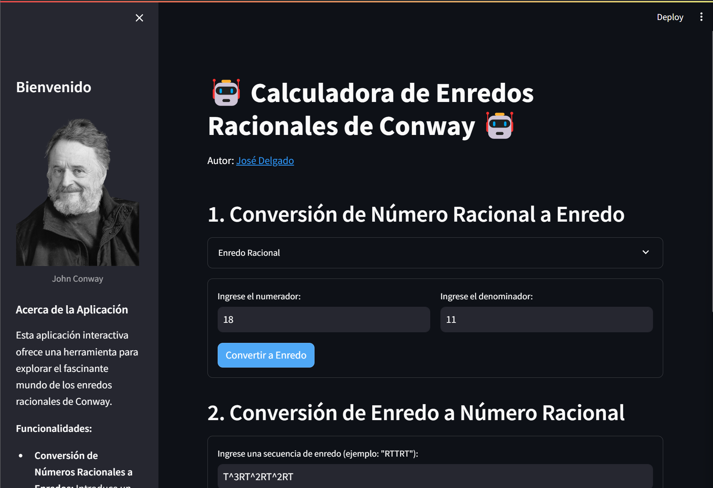
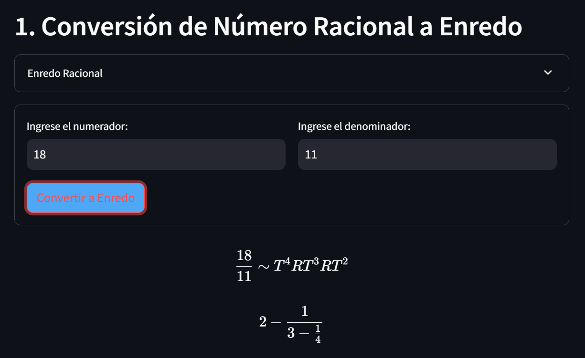
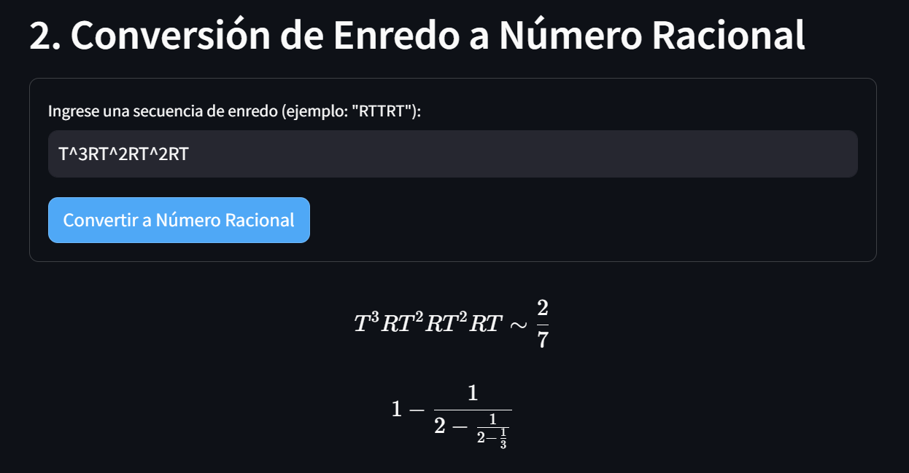
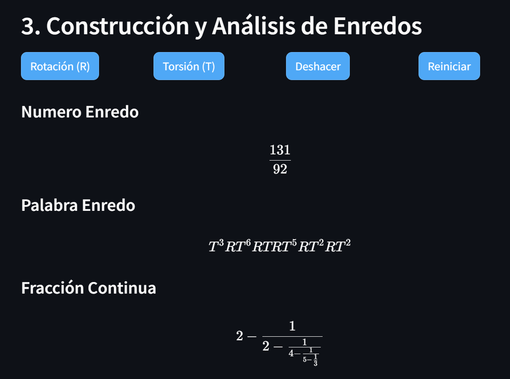

# Rational Tangles App 🌐💻
## Description 📝
Welcome to the Rational Tangles App! This tool allows you to explore the fascinating world of Conway's rational tangles interactively.

## Features 🌟
### **Interactivity**
Manipulate tangles in real-time and observe how the associated rational numbers change.

### **Mathematical Education**
Ideal for teaching or learning about rational tangles, fractional numbers, and topology.

### **Easy to Use**
Simple and clear user interface.



## How to Use 🛠️
### Rational to Tangle Conversion: Enter a rational number and discover its corresponding tangle.


### Tangle to Rational Conversion: Input a tangle sequence and see how it translates into a rational number.


### Interactive Playground: Experiment with different tangle sequences and observe real-time results.


## Installation & Execution 🚀
To run the application in your local environment:

```python
git clone https://github.com/hypergalois/rationalTangles.git
cd rationalTangles
streamlit run rational_tangle_calculator.py
```

## Contributions 🤝
Contributions are welcome! If you have ideas to improve the application or want to add new features, feel free to fork the repository and submit your pull requests.

**TODO**: Organize code, functions into a `util.py`.

## License ⚖️
This project is under the MIT License.

## Contact 📩
Have questions or feedback? Reach out to me at jose.delgado2@live.u-tad.com.
